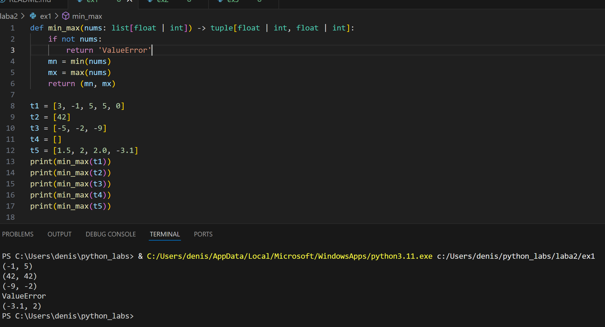
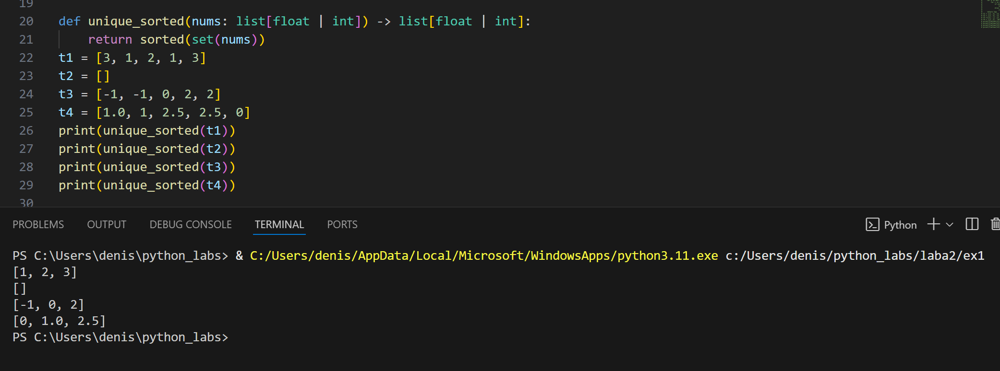
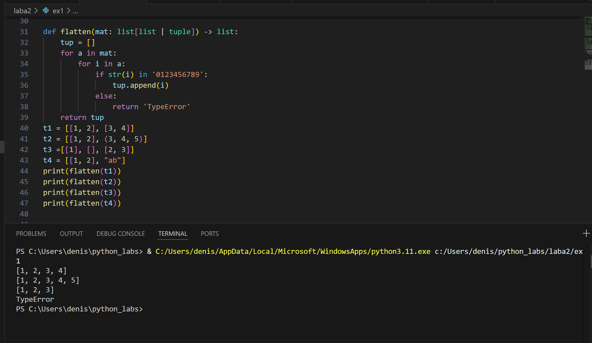
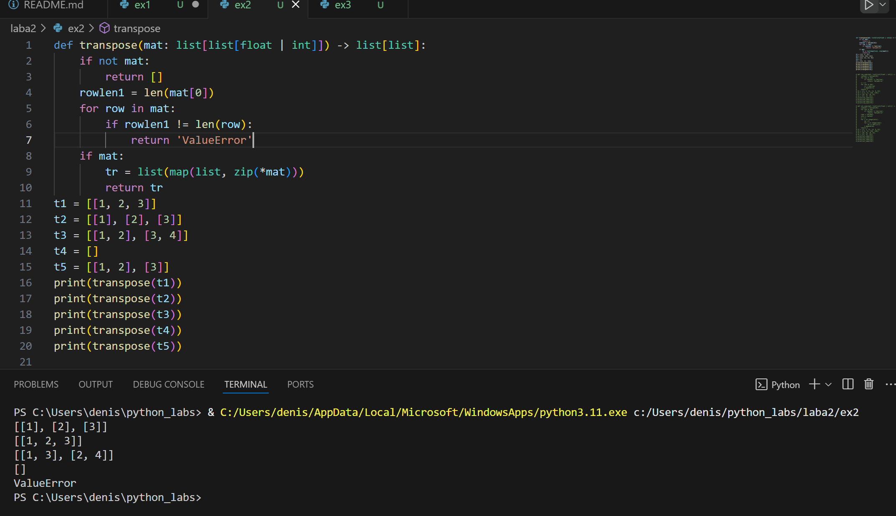
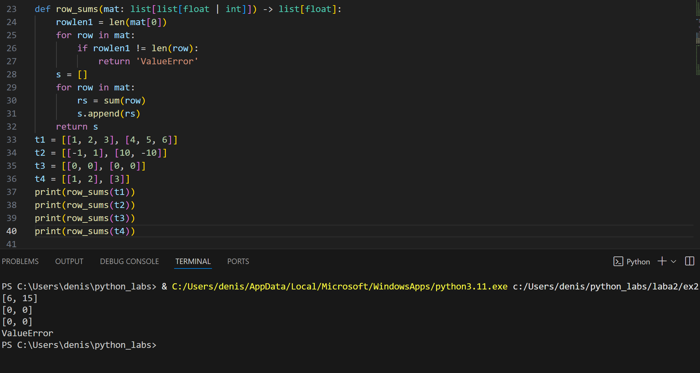
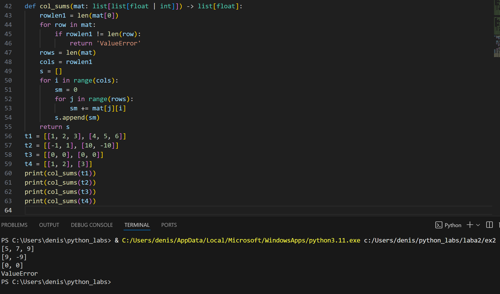
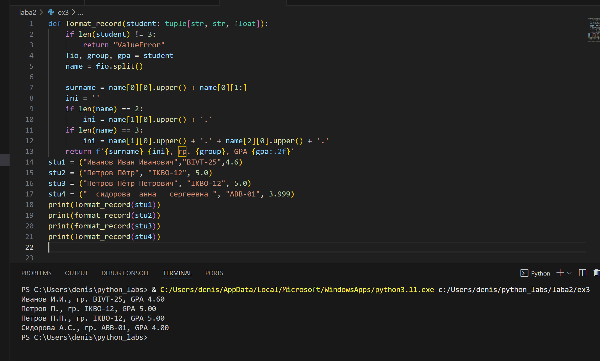

## Лабораторная работа 2
### Задание 1 (arrays)
#### min_max.py
```Python
def min_max(nums: list[float | int]) -> tuple[float | int, float | int]:
    if not nums:
        return 'ValueError'
    mn = min(nums)
    mx = max(nums)
    return (mn, mx)

t1 = [3, -1, 5, 5, 0]
t2 = [42]
t3 = [-5, -2, -9]
t4 = []
t5 = [1.5, 2, 2.0, -3.1]
print(min_max(t1))
print(min_max(t2))
print(min_max(t3))
print(min_max(t4))
print(min_max(t5))
```


#### unique_sorted.py
```Python
def unique_sorted(nums: list[float | int]) -> list[float | int]:
    return sorted(set(nums))
t1 = [3, 1, 2, 1, 3]
t2 = []
t3 = [-1, -1, 0, 2, 2]
t4 = [1.0, 1, 2.5, 2.5, 0]
print(unique_sorted(t1))
print(unique_sorted(t2))
print(unique_sorted(t3))
print(unique_sorted(t4))
```

#### flatten.py
```Python
def flatten(mat: list[list | tuple]) -> list:
    tup = []
    for a in mat:
        for i in a:
            if str(i) in '0123456789':
                tup.append(i)
            else:
                return 'TypeError'
    return tup
t1 = [[1, 2], [3, 4]]
t2 = [[1, 2], (3, 4, 5)]
t3 =[[1], [], [2, 3]]
t4 = [[1, 2], "ab"]
print(flatten(t1))
print(flatten(t2))
print(flatten(t3))
print(flatten(t4))
```

### Задание 2 (matrix)
#### transpose.py
```python
def transpose(mat: list[list[float | int]]) -> list[list]:
    if not mat:
        return []  
    rowlen1 = len(mat[0])
    for row in mat:
        if rowlen1 != len(row):
            return 'ValueError'
    if mat:
        tr = list(map(list, zip(*mat)))
        return tr
t1 = [[1, 2, 3]]
t2 = [[1], [2], [3]]
t3 = [[1, 2], [3, 4]]
t4 = []
t5 = [[1, 2], [3]]
print(transpose(t1))
print(transpose(t2))
print(transpose(t3))
print(transpose(t4))
print(transpose(t5))
```


#### row_sums
```python
def row_sums(mat: list[list[float | int]]) -> list[float]:
    rowlen1 = len(mat[0])
    for row in mat:
        if rowlen1 != len(row):
            return 'ValueError'
    s = []
    for row in mat:
        rs = sum(row)
        s.append(rs)
    return s
t1 = [[1, 2, 3], [4, 5, 6]]
t2 = [[-1, 1], [10, -10]]
t3 = [[0, 0], [0, 0]]
t4 = [[1, 2], [3]]
print(row_sums(t1))
print(row_sums(t2))
print(row_sums(t3))
print(row_sums(t4))
```


#### col_sums
```python
def col_sums(mat: list[list[float | int]]) -> list[float]:
    rowlen1 = len(mat[0])
    for row in mat:
        if rowlen1 != len(row):
            return 'ValueError'
    rows = len(mat)
    cols = rowlen1
    s = []
    for i in range(cols):
        sm = 0
        for j in range(rows):
            sm += mat[j][i]
        s.append(sm)
    return s
t1 = [[1, 2, 3], [4, 5, 6]]
t2 = [[-1, 1], [10, -10]]
t3 = [[0, 0], [0, 0]]
t4 = [[1, 2], [3]]
print(col_sums(t1))
print(col_sums(t2))
print(col_sums(t3))
print(col_sums(t4))
```


### Задание 3 (Tuples.py)
```Python
def format_record(student: tuple[str, str, float]):
    if len(student) != 3:
        return "ValueError"
    fio, group, gpa = student
    name = fio.split()

    surname = name[0][0].upper() + name[0][1:]
    ini = ''
    if len(name) == 2:
        ini = name[1][0].upper() + '.'
    if len(name) == 3:
        ini = name[1][0].upper() + '.' + name[2][0].upper() + '.'
    return f'{surname} {ini}, гр. {group}, GPA {gpa:.2f}'
stu1 = ("Иванов Иван Иванович","BIVT-25",4.6)
stu2 = ("Петров Пётр", "IKBO-12", 5.0)
stu3 = ("Петров Пётр Петрович", "IKBO-12", 5.0)
stu4 = ("  сидорова  анна   сергеевна ", "ABB-01", 3.999)
print(format_record(stu1))
print(format_record(stu2))
print(format_record(stu3))
print(format_record(stu4))
```
!
