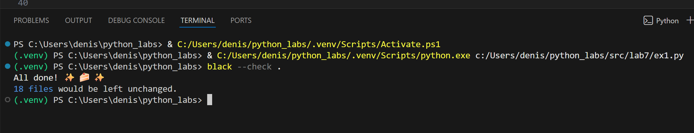
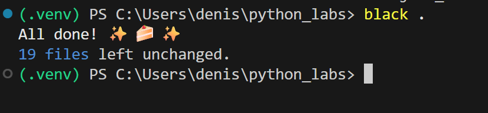
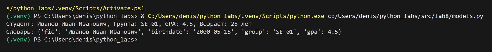
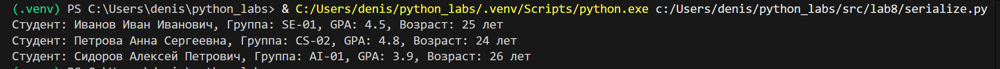
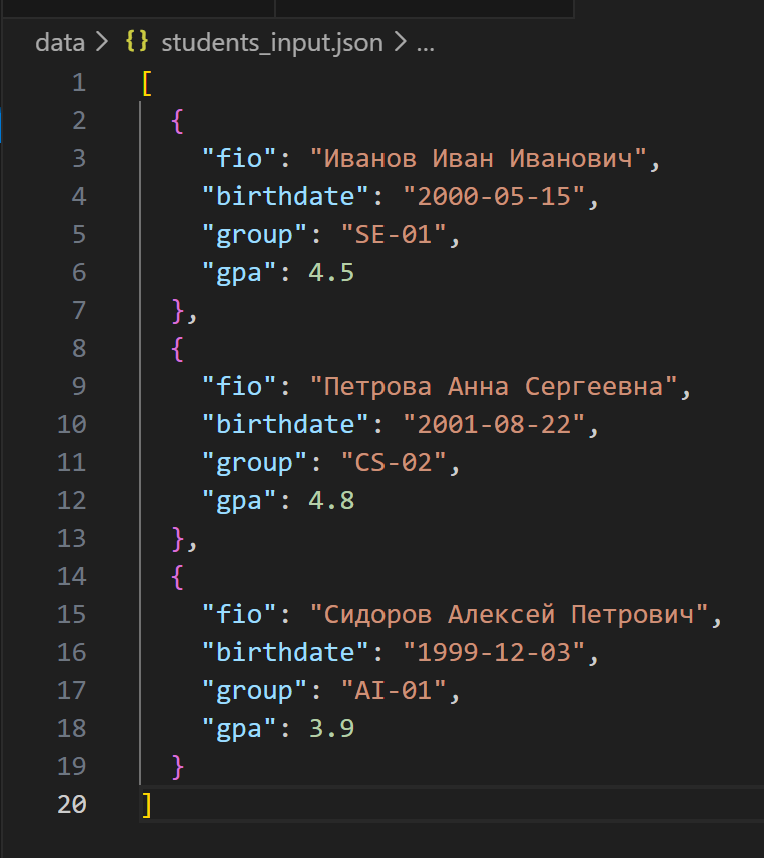
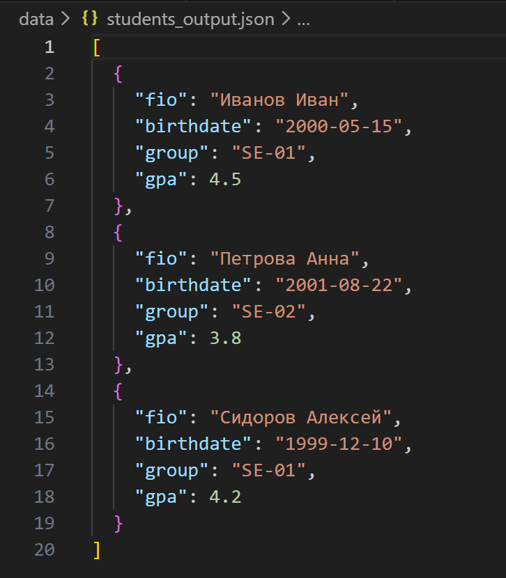

## Лабораторная работа 7
### A. Тесты для text.py
```python
import sys
import os
import pytest


sys.path.insert(0, os.path.join(os.path.dirname(__file__), ".."))  # путь к папке src

from lib.text import normalize, tokenize, count_freq, top_n


# тесты для normalize
@pytest.mark.parametrize(
    "source, expected",
    [
        ("ПрИвЕт\nМИр\t", "привет мир"),
        ("ёжик, Ёлка", "ежик, елка"),
        ("Hello\r\nWorld", "hello world"),
        ("  двойные   пробелы  ", "двойные пробелы"),
        ("", ""),  # пустая строка
        ("   ", ""),  # только пробелы
    ],
)
def test_normalize(source, expected):
    assert normalize(source) == expected


# тесты для tokenize
@pytest.mark.parametrize(
    "text, expected",
    [
        ("привет мир", ["привет", "мир"]),
        ("hello world test", ["hello", "world", "test"]),
        ("", []),  # пустая строка
        ("   ", []),  # только пробелы
        ("знаки, препинания! тест.", ["знаки", "препинания", "тест"]),
    ],
)
def test_tokenize(text, expected):
    assert tokenize(text) == expected


# тесты для count_freq
@pytest.mark.parametrize(
    "tokens, expected",
    [
        (["a", "b", "a", "c", "b", "a"], {"a": 3, "b": 2, "c": 1}),
        ([], {}),  # пустой список
        (["word"], {"word": 1}),  # один элемент
    ],
)
def test_count_freq(tokens, expected):
    assert count_freq(tokens) == expected

    # тесты для top_n
    "freq_dict, n, expected",
    [
        # Обычный случай
        ({"a": 3, "b": 2, "c": 1}, 3, [("a", 3), ("b", 2), ("c", 1)]),
        # Одинаковые частоты → сортировка по алфавиту
        (
            {"яблоко": 2, "апельсин": 2, "банан": 2},
            3,
            [("апельсин", 2), ("банан", 2), ("яблоко", 2)],
        ),
        # Пустой словарь
        ({}, 5, []),
        # Больше элементов чем n
        (
            {"a": 5, "b": 4, "c": 3, "d": 2, "e": 1, "f": 1},
            3,
            [("a", 5), ("b", 4), ("c", 3)],
        ),
        # n = 0
        ({"a": 1, "b": 2}, 0, []),
    ],


def test_top_n(freq_dict, n, expected):
    assert top_n(freq_dict, n) == expected

```

### B. Тесты для json_csv.py

```python
import pytest
import json
import csv
from pathlib import Path
import sys
import os

sys.path.insert(0, os.path.join(os.path.dirname(__file__), ".."))  # путь к src
from lab5.json_csv import json_to_csv, csv_to_json


def test_json_to_csv_simple(tmp_path):
    # простая конвертация JSON → CSV
    json_file = tmp_path / "test.json"
    csv_file = tmp_path / "test.csv"

    test_data = [{"name": "Alice", "age": 22}, {"name": "Bob", "age": 25}]

    json_file.write_text(json.dumps(test_data), encoding="utf-8")
    json_to_csv(str(json_file), str(csv_file))

    assert csv_file.exists()

    with csv_file.open(encoding="utf-8") as f:
        reader = csv.DictReader(f)
        rows = list(reader)

        assert len(rows) == 2
        assert {"name", "age"} == set(rows[0].keys())
        assert rows[0]["name"] == "Alice"


def test_csv_to_json_simple(tmp_path):
    # простая конвертация CSV → JSON
    csv_file = tmp_path / "test.csv"
    json_file = tmp_path / "test.json"

    csv_content = "name,age,city\nAlice,22,London\nBob,25,Paris"
    csv_file.write_text(csv_content, encoding="utf-8")

    csv_to_json(str(csv_file), str(json_file))

    assert json_file.exists()

    with json_file.open(encoding="utf-8") as f:
        data = json.load(f)

        assert len(data) == 2
        assert set(data[0].keys()) == {"name", "age", "city"}
        assert data[0]["name"] == "Alice"


def test_json_to_csv_roundtrip(tmp_path):
    # полный цикл конвертации
    original_data = [{"name": "Alice", "age": 22}, {"name": "Bob", "age": 25}]

    original_json = tmp_path / "original.json"
    converted_csv = tmp_path / "converted.csv"
    final_json = tmp_path / "final.json"

    original_json.write_text(json.dumps(original_data), encoding="utf-8")
    json_to_csv(str(original_json), str(converted_csv))
    csv_to_json(str(converted_csv), str(final_json))

    with final_json.open(encoding="utf-8") as f:
        final_data = json.load(f)

    assert final_data == original_data


def test_file_not_found():
    # тестируем ошибку когда файл не существует
    with pytest.raises(FileNotFoundError):
        json_to_csv("nonexistent.json", "output.csv")
    with pytest.raises(FileNotFoundError):
        csv_to_json("nonexistent.csv", "output.json")


def test_invalid_cases(tmp_path):
    # тестируем различные ошибочные случаи
    # Некорректный JSON
    json_file = tmp_path / "broken.json"
    json_file.write_text("{ invalid json }", encoding="utf-8")
    with pytest.raises(ValueError):
        json_to_csv(str(json_file), "output.csv")

    # Пустые файлы
    empty_file = tmp_path / "empty.json"
    empty_file.write_text("", encoding="utf-8")
    with pytest.raises(ValueError):
        json_to_csv(str(empty_file), "output.csv")

    # Неправильная структура JSON
    json_file.write_text(json.dumps(["not", "a", "dict"]), encoding="utf-8")
    with pytest.raises(ValueError):
        json_to_csv(str(json_file), "output.csv")

    # Пустой список в JSON
    json_file.write_text(json.dumps([]), encoding="utf-8")
    with pytest.raises(ValueError):
        json_to_csv(str(json_file), "output.csv")

    # CSV только с заголовками
    csv_file = tmp_path / "headers.csv"
    csv_file.write_text("name,age\n", encoding="utf-8")
    with pytest.raises(ValueError):
        csv_to_json(str(csv_file), "output.json")


def test_json_to_csv_different_fields(tmp_path):
    # тестируем JSON с разными полями в записях
    json_file = tmp_path / "test.json"
    csv_file = tmp_path / "test.csv"

    test_data = [
        {"name": "Alice", "age": 25},
        {"name": "Bob", "age": 30, "city": "London"},
        {"name": "Charlie", "city": "Paris"},
    ]

    json_file.write_text(json.dumps(test_data), encoding="utf-8")
    json_to_csv(str(json_file), str(csv_file))

    assert csv_file.exists()

    with csv_file.open(encoding="utf-8") as f:
        reader = csv.DictReader(f)
        rows = list(reader)
        assert len(rows) == 3
        assert {"name", "age", "city"} == set(rows[0].keys())


def test_csv_to_json_number_conversion(tmp_path):
    # тестируем преобразование чисел из строк
    csv_file = tmp_path / "test.csv"
    json_file = tmp_path / "test.json"

    csv_content = "name,age,score\nAlice,25,95.5\nBob,30,87.0"
    csv_file.write_text(csv_content, encoding="utf-8")
    csv_to_json(str(csv_file), str(json_file))

    with json_file.open(encoding="utf-8") as f:
        data = json.load(f)
        assert data[0]["age"] == 25
        assert data[0]["score"] == 95.5


def test_wrong_extensions(tmp_path):
    # тестируем неправильные расширения файлов
    wrong_file = tmp_path / "file.txt"
    wrong_file.write_text("some content", encoding="utf-8")

    with pytest.raises(ValueError):
        json_to_csv(str(wrong_file), "output.csv")
    with pytest.raises(ValueError):
        csv_to_json(str(wrong_file), "output.json")


def test_special_cases(tmp_path):
    # тестируем специальные случаи
    # одна запись в JSON
    json_file = tmp_path / "single.json"
    json_file.write_text(json.dumps([{"name": "Alice", "age": 25}]), encoding="utf-8")
    json_to_csv(str(json_file), tmp_path / "single.csv")

    # юникод символы
    json_file = tmp_path / "unicode.json"
    test_data = [{"name": "Анна", "city": "Москва"}, {"name": "Böb", "city": "München"}]
    json_file.write_text(json.dumps(test_data, ensure_ascii=False), encoding="utf-8")
    json_to_csv(str(json_file), tmp_path / "unicode.csv")

    # специальные символы в CSV
    csv_file = tmp_path / "special.csv"
    csv_content = 'name,comment\nAlice,"Text, with, commas"'
    csv_file.write_text(csv_content, encoding="utf-8")
    csv_to_json(str(csv_file), tmp_path / "special.json")

```
### C. Стиль кода (black)



## Лабораторная работа 8
### A. Реализовать класс Student (models.py)
```python
from dataclasses import dataclass
from datetime import datetime, date
from typing import Dict, Any

@dataclass # Декоратор, который автоматически генерирует методы __init__, __repr__, __eq__
class Student: # Объявление класса Student
    fio: str
    birthdate: str
    group: str
    gpa: float

    def __post_init__(self):
        """Валидация данных после инициализации"""
        try:
            datetime.strptime(self.birthdate, "%Y-%m-%d") #преобразование строки в дату ГГГГ-ММ-ДД
        except ValueError:
            raise ValueError(f"Invalid date format: {self.birthdate}. Use YYYY-MM-DD")
        
        if not (0 <= self.gpa <= 5): GPA в диапозоне от 0 до 5
            raise ValueError(f"GPA must be between 0 and 5, got {self.gpa}")

    def age(self) -> int:
        """Вычисление возраста студента"""
        birth_date = datetime.strptime(self.birthdate, "%Y-%m-%d").date() # Преобразование строки даты в объект date
        today = date.today()
        age = today.year - birth_date.year
        
        # Корректировка, если день рождения еще не наступил в этом году
        if today.month < birth_date.month or (today.month == birth_date.month and today.day < birth_date.day):
            age -= 1
            
        return age

    def to_dict(self) -> Dict[str, Any]:
        """Сериализация объекта в словарь"""
        return {
            "fio": self.fio, # Ключ "fio" со значением ФИО студента
            "birthdate": self.birthdate,
            "group": self.group,
            "gpa": self.gpa
        }

    @classmethod
    def from_dict(cls, data: Dict[str, Any]) -> 'Student':
        """Десериализация объекта из словаря"""
        return cls(
            fio=data["fio"], # Передача ФИО из словаря
            birthdate=data["birthdate"],
            group=data["group"],
            gpa=data["gpa"]
        )

    def __str__(self) -> str:
        """Строковое представление объекта"""
        return f"Студент: {self.fio}, Группа: {self.group}, GPA: {self.gpa}, Возраст: {self.age()} лет"

if __name__ == "__main__":
    try:
        student = Student(
            fio="Иванов Иван Иванович", # Аргумент: ФИО
            birthdate="2000-05-15",
            group="SE-01",
            gpa=4.5
        )
        print(student)
        print(f"Словарь: {student.to_dict()}")
    except ValueError as e:
        print(f"Ошибка: {e}")
```
### B. Реализовать модуль serialize.py
```python
import json
from typing import List
from models import Student

def students_to_json(students: List[Student], path: str) -> None:

    data = [student.to_dict() for student in students]  # Генератор списка: преобразуем каждый объект Student в словарь
    
    with open(path, 'w', encoding='utf-8') as f:
        json.dump(data, f, ensure_ascii=False, indent=2)

def students_from_json(path: str) -> List[Student]: #Десериализация списка студентов из JSON файла
    try:
        with open(path, 'r', encoding='utf-8') as f:
            data = json.load(f) #Загрузка и парсинг JSON данных из файла в Python
        
        students = []
        for item in data:
            try:
                student = Student.from_dict(item) # Создание объекта Student из словаря
                students.append(student)
            except (ValueError, KeyError) as e:
                print(f"Ошибка при создании студента из данных {item}: {e}")
                continue
                
        return students
    except FileNotFoundError:
        print(f"Файл {path} не найден")
        return []
    except json.JSONDecodeError:
        print(f"Ошибка декодирования JSON из файла {path}")
        return []

if __name__ == "__main__": # Проверка: запущен ли скрипт напрямую (
    # Пример использования
    students = [
        Student("Иванов Иван", "2000-05-15", "SE-01", 4.5),
        Student("Петрова Анна", "2001-08-22", "SE-02", 3.8),
        Student("Сидоров Алексей", "1999-12-10", "SE-01", 4.2)
    ]
    
    # Сериализация
    students_to_json(students, "data/students_output.json")
    
    # Десериализация
    loaded_students = students_from_json("data/students_input.json")
    for student in loaded_students:
        print(student)
```



