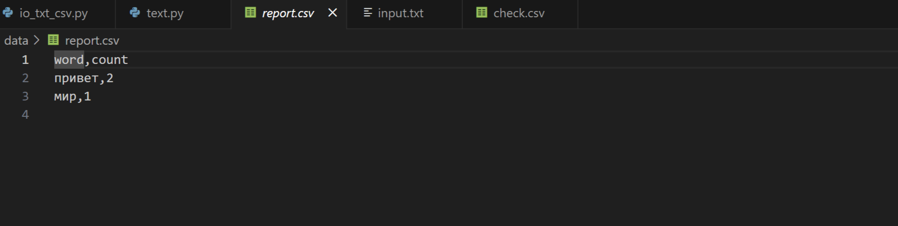

# Лаборторная работа 4
## Задание A — модуль src/lab04/io_txt_csv.py
```python
import csv
from pathlib import Path
from typing import List, Tuple, Optional


#читаем содержимое текста из файла
def read_text(path: str | Path, encoding: str = "utf-8") -> str:
    try:
        return Path(path).read_text(encoding=encoding)
    except FileNotFoundError:
        return "Файл не найден."
    except UnicodeDecodeError:
        return "Ошибка кодирования файла."


#запись данных в CSV файл
def write_csv(rows: list[tuple | list], path: str | Path, header: tuple[str, ...] | None = None) -> None:
    p = Path(path)
    with p.open('w', newline="", encoding="utf-8") as file: #w открывает файл(если он есть) и стирает все или создает его(если нет)
        f = csv.writer(file)
        if header is None and rows == []: # нет заголовка и данных
            file_c.writerow(('a', 'b')) 
        if header is not None:
            f.writerow(header)
        if rows != []:
            const = len(rows[0])
            for i in rows:
                if len(i) != const:
                    return ValueError
        f.writerows(rows)

def ensure_parent_dir(path: str | Path) -> None:
    Path(path).parent.mkdir(parents=True, exist_ok=True)


#использование функций
print(read_text(r"C:\Users\denis\python_labs\data\input.txt"))  # чтение содержимого файла input.txt
write_csv([("word", "count"), ("test", 3)], r"C:\Users\denis\python_labs\data\check.csv")  # запись в check.csv
```


## Задание B — скрипт src/lab04/text_report.py
```
from io_txt_csv import read_text, write_csv, ensure_parent_dir
import sys
from pathlib import Path

sys.path.append(r'C:\Users\Home\Documents\GitHub\lab_01\lib')

from text import normalize, tokenize, count_freq, top_n


def exist_path(path_f: str):
    return Path(path_f).exists() #существует ли файл 


def main(file: str, encoding: str = 'utf-8'): 
    if not exist_path(file):
        raise FileNotFoundError 
    
    file_path = Path(file)
    text = read_text(file, encoding=encoding) # текст в одну строку
    norm = normalize(text) 
    tokens = tokenize(norm)
    freq_dict = count_freq(tokens)
    top = top_n(freq_dict, 5)
    top_sort = sorted(top, key=lambda x: (x[1], x[0]), reverse=True) #сортируем список топовых слов сначала по частоте, а потом по алфавиту.
    report_path = file_path.parent / 'report.csv' # cоздает путь для файла отчета в той же папке, где исходный файл
    write_csv(top_sort, report_path, header=('word', 'count')) #записываем отсортированнный список  в цсв файл с заголовком
    
    print(f'Всего слов: {len(tokens)}')
    print(f'Уникальных слов: {len(freq_dict)}')
    print('Топ-5:')
    for cursor in top_sort:
        print(f'{cursor[0]}: {cursor[-1]}')


main(r'C:\Users\Home\Documents\GitHub\lab_01\data\input.txt')
```

