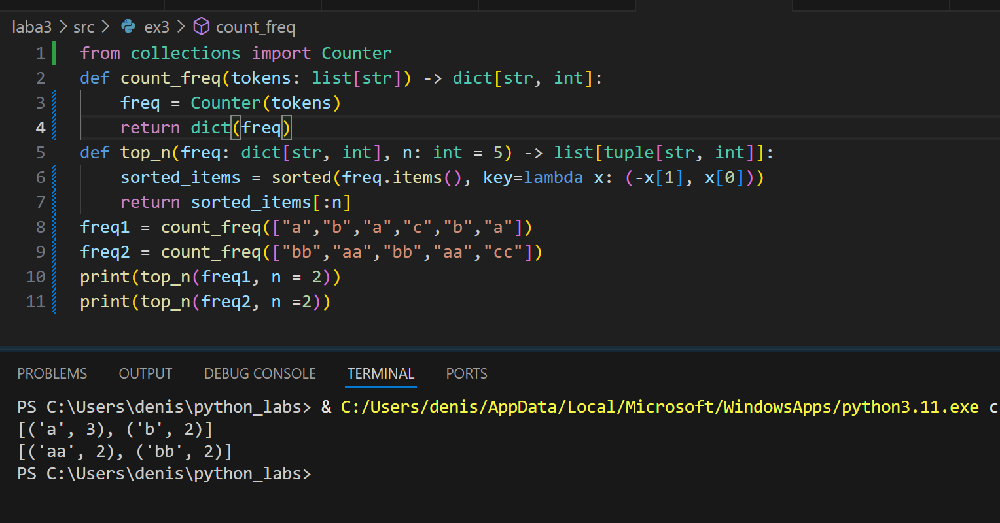

# Лаборторная работа 3
## Задание A — src/lib/text.py
### normalize
```
def normalize(text: str, *, casefold: bool = True, yo2e: bool = True) -> str:
    text = text.casefold()
    if yo2e:
        text = text.replace('ё', 'е').replace('Ё', 'Е')
    text = text.replace('\t', ' ').replace('\r', ' ').replace('\n', ' ')
    text = ' '.join(text.split())
    text = text.strip()
    return text
print(normalize("ПрИвЕт\nМИр\t")) 
print(normalize("ёжик, Ёлка"))
print(normalize("Hello\r\nWorld"))
print(normalize("  двойные   пробелы  "))
```

### tokenize 
```
import re 
def tokenize(text: str) -> list[str]:
    return re.findall(r'\w+(?:-\w+)*', text)
print(tokenize("привет мир"))
print(tokenize("hello,world!!!"))
print(tokenize("по-настоящему круто"))
print(tokenize("2025 год"))
print(tokenize("emoji 😀 не слово"))

```


### count_freq + top_n
```
from collections import Counter
def count_freq(tokens: list[str]) -> dict[str, int]:
    freq = Counter(tokens)
    return dict(freq)
def top_n(freq: dict[str, int], n: int = 5) -> list[tuple[str, int]]:
    sorted_items = sorted(freq.items(), key=lambda x: (-x[1], x[0]))
    return sorted_items[:n]
freq1 = count_freq(["a","b","a","c","b","a"])
freq2 = count_freq(["bb","aa","bb","aa","cc"])
print(top_n(freq1, n = 2))
print(top_n(freq2, n =2))
```



## Задание B — src/text_stats.py (скрипт со stdin)
```
from lib.text import normalize, tokenize, count_freq, top_n
import sys
def main():
    text = sys.stdin.buffer.read().decode('utf-8') #вход к бинарным данным,преобразует строку в юникод
    if not text.strip():
        print("Нет входных данных")
        return
    normalized_text = normalize(text)
    tokens = tokenize(normalized_text)
    

    if not tokens:
        print("В тексте не найдено слов")
        return

    total_words = len(tokens) # общее количество слов
    freq_dict = count_freq(tokens) # словарь частот
    unique_words = len(freq_dict) # количеситво уникальных слов 
    top_words = top_n(freq_dict, 5) # самые популярные частоты
    
    print(f"Всего слов: {total_words}")
    print(f"Уникальных слов: {unique_words}")
    print("Топ-5:")
    for word, count in top_words:
        print(f"{word}: {count}")


if __name__ == "__main__":  
    main()
```
