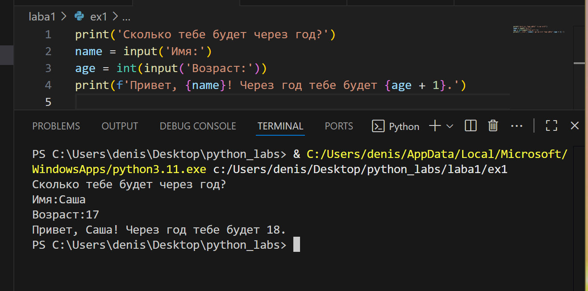

## Лабораторная работа 1

### Задание 1
```python
print('Сколько тебе будет через год?')
name = input('Имя:')
age = int(input('Возраст:'))
print(f'Привет, {name}! Через год тебе будет {age + 1}.')
```


### Задание 2
```python
a = float(input('Число a:').replace(',','.'))
b = float(input('Число b:').replace(',','.'))
sum = a + b
sr_arif = sum / 2
print('SUM = ', round(sum,2))
print('AVG = ', round(sr_arif, 2))
```


### Задание 3
```python
cost = float(input('Введите цену: '))
sale = float(input('Введите размер скидки: '))
nds = float(input('Введите НДС: '))
costwsale = (1 - sale / 100) * cost
nds1 = (nds / 100) * costwsale 
totalsum = costwsale + nds1
print(f'База после скидки: {costwsale:.2f} p')
print(f'НДС: {nds1:.2f} p')
print(f'Итого к оплате: {totalsum:.2f} p')
```


### Задание 4
```python
m = int(input('Минуты: '))
print(f"{m // 60}:{m% 60}")
```


### Задание 5
```python
fio = input('ФИО: ')
a = fio.split()
f = a[0][:1] + a[1][:1] + a[2][:1]
print(f)
print(len(fio))
```

